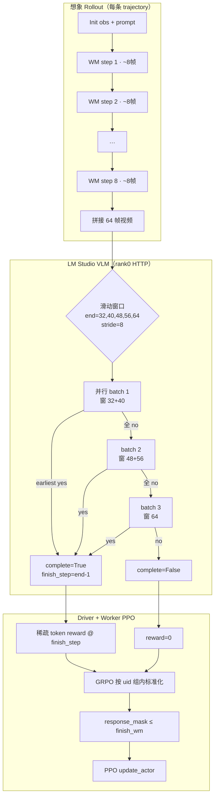

# 组件 3 · verl GRPO + PPO

组件 3 基于 **verl**：Ray 分布式 **in-process 视频-动作模型 rollout** → **VideoMAE** 稀疏 reward → **GRPO** → **PPO 更新 action head 可训子集**（`full` 或 `lora` + projector）。

**入口：** `bash scripts/train_component3_rl.sh`（=`vampo-train`）  
**配置：** `configs/vampo_ppo_trainer.yaml`（单机 FSDP）· `configs/vampo_ppo_trainer_cluster4.yaml`（四机 Megatron TP=4 + LoRA）  
**模型：** `model.backend: vla`，`rollout.policy_backend: vla`

组件 3 使用 **in-process** DreamZero rollout，无需独立推理服务。

## 算法

| 环节 | 实现 |
|------|------|
| Rollout | `VLAPolicyModule` + `InProcessVLABackend` → `ImaginationRollout` |
| 策略随机性 | Flow matching **联合去噪链**（K=16）：action latent + video latent 每步 `μ + σ·ε` |
| Reward | `vampo/reward/videomae_reward.py` · 8 帧滑窗 `predict_success`（冻结） |
| Advantage | **GRPO** `compute_vampo_grpo_outcome_advantage`（`rollout_log_prob_scalar` tie-break） |
| 策略更新 | **PPO** `VAMPODPOActor` · 联合 flow chain log prob · action head 可训子集 |

### 微调模式（`configs/vampo_ppo_trainer.yaml`）

| `rl_fine_tune_mode` | 行为 |
|---------------------|------|
| **`full`**（默认） | merge LoRA → 训练 **Wan DiT + action_encoder/decoder/state_encoder** |
| `lora` | 仅训练 LoRA adapter + 上述 projector（省显存） |

```yaml
model:
  rl_fine_tune_mode: full   # 或 lora
  tune_projector: true
  tune_diffusion_model: true
  actor.optim.lr: 5.0e-6    # 全量建议 ≤1e-5；LoRA 可用 5e-4
```

## PPO log prob（联合全链）

> **详细计算逻辑图与公式：** [docs/VAMPO_LOG_PROB.md](./VAMPO_LOG_PROB.md)（trace / 重放 / PPO ratio / 代码索引）

DreamZero 类模型每 WM 步含 **K 步 flow 去噪**（默认 K=16）。Rollout 时记录：

| 字段 | 形状 | 含义 |
|------|------|------|
| `action_path` | `[K+1, H, D]` | action latent 轨迹 |
| `action_eps` | `[K, H, D]` | action 链每步噪声 |
| `video_path` | `[K+1, …]` | video latent 轨迹 |
| `video_eps` | `[K, …]` | video 链每步噪声 |

联合 log prob（每个 WM 步一个标量，PPO 中按 `action_token_len` 展开 mask）：

```
log π = log N(x_T^a; 0,I) + log N(z_T^v; 0,I)
      + Σ_k [ log N(x_{k-1}^a | μ_k^a, σ_a) + log N(z_{k-1}^v | μ_k^v, σ_v) ]
```

- Update 时用存下来的 path/ε **重放去噪链**，对当前 **action head 权重** 重算 μ，得到 on-policy ratio。
- **无** 外层 `log_std` / 对 `action_pred` 再套 Gaussian。

### 配置项

| 键 | 默认 | 说明 |
|----|------|------|
| `flow_rl_sigma` | `0.05` | action 链转移噪声 σ_a |
| `flow_rl_video_sigma` | `0.05` | video 链转移噪声 σ_v |
| 环境变量 | `VAMPO_FLOW_RL_SIGMA` / `VAMPO_FLOW_RL_VIDEO_SIGMA` | 覆盖 yaml |

## 数据集

| 类型 | 路径 | 必需 |
|------|------|------|
| Init manifest | `data/init_states/manifest.json` | ✅ |
| Init 观测 | `data/init_states/*_obs.npy` | ✅ |
| VideoMAE ckpt | `checkpoints/videomae_droid.pth`（`VIDEOMAE_CKPT`） | ✅ |
| 视频-动作 ckpt | `/home/robotem/Models/DreamZero-DROID` | ✅ |

## Checkpoint

| 类型 | 路径 | 方向 |
|------|------|------|
| 基座 | `model.path` / `vla.model_path` | 输入：完整 DreamZero-DROID（~14B 级）；**backbone + VAE/enc 冻结** |
| PPO 可训 | Wan DiT + action enc/dec/state enc（`rl_fine_tune_mode: full`） | 每 step 梯度更新 |
| RL 超参 | `flow_rl_sigma` / `flow_rl_video_sigma` / `rl_fine_tune_mode` | 写入 `policy.pt` |
| Reward | VideoMAE @ GPU（冻结） | 外部 HTTP judge（可选 lmstudio） |
| 产出 | `outputs/vampo_verl/.../policy.pt` | **差分 ckpt**（`requires_grad` 权重 + σ；非完整 14B） |
| 续训 | `model.rl_checkpoint`（可选） | 基座加载后 `load_rl_checkpoint(policy.pt)` 覆盖可训权重 |

## 逻辑图

以下从 **Hydra 入口 → verl RayTrainer → Worker 数据流** 展开。单机 `train_batch_size=1, n_samples=8`；四机 cluster4 当前为 `1×4=4` 条轨迹/step，`max_wm_steps=8`。

### 0. 系统拓扑

```
Hydra: vampo_ppo_trainer.yaml
        │
        ▼
┌─ Ray Driver · main_task ─────────────────────────────────────────────┐
│  RayTrainer.fit()                                                    │
│    ├─ VAMPOInitStateDataset (manifest.json + *_obs.npy)              │
│    ├─ VAMPORewardManager                                             │
│    └─ compute_advantage → GRPO                                       │
│         │                                                            │
│         │ init_workers / fit RPC                                     │
│         ▼                                                            │
│  ResourcePool · world_size = nnodes × n_gpus                         │
│    ├─ Worker rank0 @ .31  (FSDP 读 checkpoint；避开 .41 head)          │
│    ├─ Worker rank1 @ .41  (Ray driver 本机，无 rank0 负载)            │
│    ├─ Worker rank2 @ .21                                             │
│    └─ Worker rank3 @ .11                                             │
│         │                                                            │
│         ▼                                                            │
│  VAMPOActorRolloutRefWorker（hybrid_engine）                         │
│    VAMPORollout → ImaginationRollout → InProcessVLABackend           │
│      → VLAPolicyModule ← VAMPODPOActor                               │
│      → VideoMAERewardModel（TP rank0 推理 + broadcast）               │
│      → FSDP 或 Megatron TP=4（cluster4）                             │
│         │                                                            │
│         │ DP_COMPUTE_PROTO: generate_sequences / update_actor         │
│         ▼                                                            │
│  DataProto concat ──► Driver ──► GRPO advantages ──► update RPC    │
└──────────────────────────────────────────────────────────────────────┘
```

| 并行层 | 机制 | 作用 |
|--------|------|------|
| **Ray DP** | `DP_COMPUTE_PROTO` | batch 按 `world_size` 切到各 GPU worker，结果 concat 回 Driver |
| **FSDP** | `actor.strategy: fsdp` | 单 worker 内 16B VLA **FULL_SHARD**（参数 1/world_size） |
| **Hybrid** | `hybrid_engine: true` | 同一进程兼 **rollout + actor**，共享 `VLAPolicyModule` |

---

### 1. 启动链（仅冷启动一次，含 FSDP wrap）

```
vampo-train / train_component3_rl*.sh
        │
        ▼
main_vampo_ppo.py · ray.init(runtime_env)
        │
        ▼
main_task @ray.remote
        │
        ▼
RayTrainer.init_workers()
        │
        ▼
VAMPORayWorkerGroup · rank0 PG 固定 .31（非 .41 head）
        │
        ▼
worker.init_model() × world_size
        │
        ├─ _build_policy() → VLAPolicyModule
        ├─ rank0: safetensor → CUDA bf16  |  rank>0: meta→empty
        ├─ _maybe_wrap_fsdp() → sequential DiT block wrap (40×) + outer FSDP
        └─ VAMPORollout + VAMPODPOActor
        │
        ▼
trainer.fit() 训练循环
```

> **冷启动税**：`FSDP(...)` 含 flatten + sync_module_states broadcast，约 20–40+ 分钟；**每个 PPO step 不再重复**。

---

### 2. 单 PPO Step 总览（`RayTrainer.fit()` 内层 `for epoch in total_epochs`）

一步 = **1 次 rollout 收集 + 1 次 PPO 更新** → `global_steps += 1`。

```
① Driver: dataloader.get_next_batch() → state_id, init_index
        │
        ▼
② Driver: 每 init 分配 uid，复制 n_samples 份 → gen_batch
        │
        ▼
③ Worker: generate_sequences [DP] · 想象 rollout + VLM + old_log_probs
        │
        ▼
④ Driver: reward_fn.verify → acc / format metrics
        │
        ▼
⑤ Driver: 累积至 batch_size×n_samples 条轨迹
        │
        ├─ 不足 32 条 ──► 回到 ①
        │
        └─ 已满 ──► ⑥ reward_fn() → token_level_scores
                      │
                      ▼
                   ⑦ apply_kl_penalty (kl_coef=0 时跳过)
                      │
                      ▼
                   ⑧ GRPO advantage · 按 uid 组内标准化
                      │
                      ▼
                   ⑨ Worker: update_actor [DP] · PPO + FSDP backward
                      │
                      ▼
                   ⑩ Worker: compute_entropy
                      │
                      ▼
                   ⑪ Driver: log / save policy.pt
```

**规模对照：**

| 配置 | train_batch_size | n_samples | max_wm | 轨迹/step | infer/step |
|------|------------------|-----------|--------|-----------|------------|
| 单机 | 1 | 8 | 8 | 8 | 64 |
| cluster4 | 1 | 4 | 8 | **4** | **32** |

---

### 3. Rollout 数据流（Worker · `generate_sequences`）

```
gen_batch · init_index[], n_samples=8
        │
        ▼
┌─ 每个 init_index（DP 每 rank 1 个）──────────────────────────────────┐
│  InitStateStore.get(index) → obs dict, prompt                        │
│       │                                                              │
│       ▼                                                              │
│  ImaginationRollout.rollout_group · n_samples=8 条轨迹               │
│       │                                                              │
│       ▼                                                              │
│  ┌─ 每条轨迹 rollout_one ─────────────────────────────────────┐    │
│  │  loop max_wm_steps:                                          │    │
│  │    InProcessVLABackend.infer · VLAPolicyModule.sample_step   │    │
│  │      rl_mode=trace · μ + σ·ε 去噪链                          │    │
│  │      → ChunkRecord: action, video, action_path/eps, …        │    │
│  │  （8 轮 WM 结束后）LM Studio predict_success → complete, finish_step │    │
│  └──────────────────────────────────────────────────────────────┘    │
│       │                                                              │
│       ▼                                                              │
│  trajectories_to_dataproto → DataProto                               │
│       │                                                              │
│       ▼                                                              │
│  actor.compute_log_prob (rl_mode=log_prob) → old_log_probs           │
└──────────────────────────────────────────────────────────────────────┘
```

**Flow trace（每 WM 步 · K=16 去噪步）：**

| 字段 | Shape | 用途 |
|------|-------|------|
| `action_path` | `[K+1, H, D]` | rollout 走过的 action latent 轨迹 |
| `action_eps` | `[K, H, D]` | 每步噪声 ε（PPO 重放时固定） |
| `video_path/eps` | 同上（video latent 维） | action+video **联合** log prob |

**VLA 前向（rollout）：**

```
obs → lazy_joint_forward_causal(rl_mode="trace")
  → DiT 预测 flow → scheduler 得 μ
  → x = μ + σ·ε（σ = flow_rl_sigma / flow_rl_video_sigma）
  → 记录 path/eps；输出 action(8,8), imagined video
```

---

### 4. Driver 侧 Reward → GRPO

```
Worker 已写入 batch
  complete [B] bool
  finish_step [B] WM 步数
  old_log_probs [B,512]
        │
        ▼
┌─ Driver · VAMPORewardManager ────────────────────────────────────────┐
│  verify: complete → acc                                              │
│       │                                                              │
│       ▼                                                              │
│  __call__: 稀疏 token reward                                         │
│    idx = finish_step×64 - 1 · 成功 ≈ +reward_coef(5)                │
│       │                                                              │
│       ▼                                                              │
│  compute_grpo_outcome_advantage                                      │
│    outcome = sum(token_level_rewards)                                │
│    按 uid 分组 → 组内 (R - μ_group) / σ_group                        │
│    broadcast → advantages [B,512]                                    │
└──────────────────────────────────────────────────────────────────────┘
        │
        ├─ old_log_probs ──┐
        └─ advantages ─────┼──► Worker update_actor (PPO)
                           │
```

**GRPO 分组（Driver 侧 `uid`，非 Trajectory 内部 uuid）：**

```
Init A (uid=aaa) ─┬─ traj 1  complete=1  R≈5
                  ├─ traj 2  complete=0  R≈0
                  └─ … ×8（同起点相对比较）
Init B (uid=bbb) ─┬─ 8 trajectories …
```

> VLM **只在 Worker rollout** 调 HTTP；Driver 的 `verify/__call__` 仅把 `complete` 映射为稀疏 token reward。

---

### 5. PPO 更新数据流（Worker · `update_actor`）

```
batch [DP shard]
  advantages, old_log_probs, obs_chunks, flow_traces, prompts
        │
        ▼
log_prob_from_batch · rl_mode=log_prob, enable_grad=True
        │
        ▼
固定 path/eps，用当前 DiT 重算 μ_new · log N(x | μ_new, σ)
        │
        ▼
ratio = exp(log π_new - log π_old)
        │
        ▼
pg_loss = clip(ratio, 1±ε) × advantage - entropy_coeff × flow_entropy
        │
        ▼
backward → FSDP clip_grad_norm → AdamW
```

| 项 | 值 |
|----|-----|
| `response_length` | `max_wm × action_token_len` = 8×64 = **512** |
| `response_mask` | `t < finish_step × 64` |
| clip | low=0.2, high=0.28 |
| lr | 5e-6（full 模式） |

---

### 6. DataProto 字段演化

| 阶段 | `batch`（TensorDict） | `non_tensor_batch` | 谁写 |
|------|----------------------|-------------------|------|
| Dataloader | `state_id`, `init_index` | `state_id_str` | Driver |
| +GRPO 组 | 同上 | + **`uid`**（每 init 一个 uuid） | Driver |
| post-rollout | + `responses [B,8,64]`, `complete`, `finish_step`, `obs_features` | + **`obs_chunks`**, **`prompts`**, **`flow_traces`** | Worker |
| +log prob | + **`old_log_probs [B,512]`** | 同上 | Worker actor |
| post-reward | + `acc`, `token_level_scores`, `gt_scores` | 同上 | Driver |
| post-GRPO | + **`advantages [B,512]`**, `returns` | 同上 | Driver |
| update | 读全部 | 读 obs_chunks / flow_traces / prompts | Worker |

**`flow_traces[i][t]` 结构（nested dict）：**

```python
{
  "action_path": Tensor [K+1, 8, 8],
  "action_eps":  Tensor [K,   8, 8],
  "video_path":  Tensor [K+1, …],
  "video_eps":   Tensor [K,   …],
}  # K = num_inference_steps = 16
```

---

### 7. 单 Step 时序（verl RPC）

```
Driver RayTrainer
        │
        ├─ get_next_batch → state_id, init_index
        ├─ uid per init, repeat n_samples
        │
        ▼
┌─ Driver ──────────────────────────────────────────────────────────────┐
│  gen_batch ──RPC [DP split]──► Worker actor_rollout                   │
│                                      │                                │
│                    ┌─────────────────┴─────────────────┐              │
│                    │  InitStateStore → obs, prompt       │              │
│                    │  × n_samples trajectories           │              │
│                    │    loop max_wm_steps:               │              │
│                    │      VLAPolicyModule.sample_step    │              │
│                    │        (rl_mode=trace)              │              │
│                    │      → action, video, flow_traces   │              │
│                    │    LM Studio :1234 predict_success  │              │
│                    │      → complete, finish_step        │              │
│                    │  compute_log_prob → old_log_probs   │              │
│                    └─────────────────┬─────────────────┘              │
│       ▲                              │                                │
│       │         DataProto [DP concat]│                                │
│       │◄─────────────────────────────┘                                │
│  verify + token_level_scores                                        │
│  GRPO advantage by uid                                              │
│       │                                                               │
│       └──────RPC [DP split]──► update_actor(batch)                    │
│                                      │                                │
│                    ┌─────────────────┴─────────────────┐              │
│                    │  log_prob replay + PPO backward   │              │
│                    │  compute_entropy                  │              │
│                    └─────────────────┬─────────────────┘              │
│       ▲                              │ metrics                        │
│       │◄─────────────────────────────┘                                │
│  log / save policy.pt (every save_freq steps)                         │
└───────────────────────────────────────────────────────────────────────┘
```

---

### 8. 端到端一图（简化）

```
manifest.json + *_obs.npy
        │
        ▼
┌─ Driver ─────────────────────────────────────────────┐
│  init_index → uid → gen_batch ──RPC──► Worker rollout │
│       ▲                                    │          │
│       │         DataProto (32 traj)        │          │
│       │◄──────────────concat────────────────┘          │
│  verify → sparse reward → GRPO(advantages)             │
│       │                                                │
│       └──────RPC──► Worker PPO update ──► policy.pt  │
└──────────────────────────────────────────────────────┘
        │
        ▼
Worker 内: obs → DreamZero VLA (FSDP)
              ├─ trace: μ+σε, path/eps
              ├─ VLM: complete?
              └─ PPO: 重放 path/eps → ∇ action head
```

---

### 9. 训练规模术语（Step / Trajectory / WM Step）

verl 配置里字段名叫 `total_epochs`，**实际含义是 PPO 全局步数（global steps）**，不是「把 init_states 全扫一遍」那种 dataset epoch。

```yaml
# configs/vampo_ppo_trainer_cluster4.yaml（当前四机）
data:
  max_wm_steps: 8
  train_batch_size: 1
  n_samples: 4
actor_rollout_ref:
  actor:
    ppo_mini_batch_size: 4
    ppo_micro_batch_size: 1    # 逐条 trajectory backward
    optim:
      total_training_steps: 24576
trainer:
  total_epochs: 24576         # = PPO global step 数（非 dataset epoch）
  cooldown_every_steps: 1
  cooldown_sec: 60
# configs/vampo_ppo_trainer.yaml（继承）
trainer:
  save_freq: 512              # 每 512 step 存 policy.pt
```

训练循环（`RayTrainer.fit()`）：

```
for epoch in range(total_epochs):   # 变量名 epoch，语义 = 1 PPO step
    rollout → reward → GRPO → compute_log_prob → update_actor
    global_steps += 1
    cooldown 60s（cluster4）
```

#### 9.0 epoch 语义速查（易混）

**`total_epochs` / 代码里的 `epoch` = 1 次 PPO global step**，不是「把 2888 个 init_states 全扫一遍」。

| 问题 | 答案（当前 cluster4） |
|------|----------------------|
| 1 PPO step 有几条 trajectory？ | **4**（= `train_batch_size` 1 × `n_samples` 4） |
| `n_samples=4` 是什么？ | **每个 init** 采 4 条 traj（1 个 GRPO 组），不是整 step 只有 4 条 init |
| `max_wm_steps=8` 是什么？ | **每条 traj** 内 8 次 WM infer |
| 1 step rollout infer 几次？ | 1×4×8 = **32 次** |
| 1 step update 几次 forward？ | **32 次** 带梯度重放（`ppo_micro_batch_size=1` 分 4 micro backward） |
| init_states 会一轮用完吗？ | **不会**；每 step 随机抽 1 个 init，2888 个会被反复采样 |

```
1 PPO step
└── init A → 4 traj（GRPO 组，同 uid）→ 4×8=32 infer → 4 reward
    合计：4 traj · 32 infer · 4 reward · GRPO · PPO 更新 1 次
```

#### 9.1 三层概念对照

| 术语 | 英文 | 含义 | cluster4 数量 |
|------|------|------|---------------|
| **PPO step** | global step | 1 次 rollout + policy 更新 | **24576**（整场） |
| **Trajectory** | imagined trajectory | 同 init 出发的完整想象路径：8 WM → ~64 帧 → VideoMAE | **4 / step**，**98304 / 场** |
| **WM step** | world-model step | 轨迹内 1 轮：obs → action → imagined ~8 帧 | **8 / trajectory**，**786432 / 场** |

> **Trajectory ≠ WM step**：一条 trajectory = `max_wm_steps` 个 WM infer 串成的「想象短片」。

#### 9.2 cluster4 单 PPO Step 展开

```
1 PPO step（global_steps += 1）
│
├─ train_batch_size = 1 个 init（A）
│
└─ init A × n_samples = 4 条 trajectory（GRPO 同组 uid）
       │
       ├─ traj A.1 ── 8 WM ── ~64 frames ── VideoMAE
       ├─ traj A.2 … A.4
       │
       ▼
   共 1 × 4 = 4 trajectories / step
       │
       ▼
   GRPO：4 条组内比 reward → advantage
   PPO：update_actor 一次（micro_batch=1 × 4 条）
```

#### 9.3 整场训练总量（cluster4）

| 指标 | 公式 | 数量 |
|------|------|------|
| PPO steps | `total_epochs` | **24,576** |
| 轨迹总数 | 24576 × 1 × 4 | **98,304** |
| WM infer 总数（仅 rollout） | 98304 × 8 | **786,432** |
| 生成帧总数 | 98304 × 64 | **~629 万** |

配置注释 `24576×1×4 ≈ 98k 轨迹`：**24576 个 PPO step × 每 step 4 条 trajectory**。

#### 9.4 与单机 / 历史 cluster4 对比

| 配置 | max_wm | train_bs | n_samples | traj/step | total_epochs | 总轨迹 | infer/step |
|------|--------|----------|-----------|-----------|--------------|--------|------------|
| 单机 `vampo_ppo_trainer.yaml` | 8 | 1 | 8 | 8 | 12288 | ~98k | 64 |
| cluster4 **当前** | **8** | **1** | **4** | **4** | **24576** | ~98k | **32** |
| cluster4 OOM 保守 | 4 | 1 | 2 | 2 | 24576 | ~49k | 8 |
| cluster4 历史（慢） | 8 | 4 | 8 | 32 | 3072 | ~98k | 256 |

---

### 9.5 Rollout / GRPO / PPO 详解（cluster4 · VideoMAE）

> **当前四机训练**（`vampo_ppo_trainer_cluster4.yaml`）使用 **VideoMAE** reward（`checkpoints/videomae_droid.pth`），非 LM Studio VLM。  
> 单机 base 配置仍可为 VLM；本节数量与数据流以 **cluster4 + VideoMAE** 为准。

#### 9.5.1 总览：四机一次 PPO Global Step

```
┌─ 数据准备（离线）─────────────────────────────────────────────────┐
│  DROID 数据集 → init_states/（2888 起点 obs+npy）                 │
│  VideoMAE ckpt（videomae_droid.pth）                              │
│  DreamZero-DROID 基座                                             │
└───────────────────────────────┬───────────────────────────────────┘
                                │
                                ▼
┌─ 四机 Ray 集群 (41/31/21/11) ─────────────────────────────────────┐
│  Ray Head :6379                                                   │
│  Megatron TP=4（4 GPU 协同 1 次 infer）                           │
└───────────────────────────────┬───────────────────────────────────┘
                                │
                                ▼
┌─ 1 个 PPO Global Step ────────────────────────────────────────────┐
│  采样 1 个 init_index（train_batch_size=1）                       │
│  └── GRPO 组 · init A（4 traj，n_samples=4）                      │
│       │                                                           │
│       ▼                                                           │
│  4 条 trajectory · 4 reward · 4 advantage                         │
│       │                                                           │
│       ▼                                                           │
│  update_actor（ppo_micro_batch_size=1，4 micro backward）         │
└───────────────────────────────────────────────────────────────────┘
```

#### 9.5.2 数量关系（核心数字）

```
┌─────────────────────────────────────────────────────────────────┐
│  1 PPO Global Step                                              │
│  ├── 1 个 init（train_batch_size=1）→ 1 个 GRPO 组              │
│  │   └── 4 条 trajectory（n_samples=4）                         │
│  │       └── 每条 8 步 WM（max_wm_steps=8）                     │
│  │           └── 每步 1 次 infer()（DreamZero ~14s，TP 四机）   │
│  │               └── 整条 trajectory 结束 → 1 个 VideoMAE reward│
│  │                                                              │
│  合计：1 × 4 × 8 = 32 次 infer / step（rollout）                │
│        1 × 4     = 4   条 trajectory / step                     │
│        1 × 4     = 4   个 reward / step                         │
│        + 32 次 update_actor 带梯度重放（4 micro backward）      │
│        4 个 GRPO advantage → 1 次 PPO 梯度更新                  │
└─────────────────────────────────────────────────────────────────┘
```

| 层级 | trajectory | infer（rollout） | reward |
|------|------------|------------------|--------|
| **1 条 trajectory** | 1 | **8** | **1** |
| **1 个 GRPO 组**（同 init） | 4 | 32 | 4 |
| **1 个 PPO step**（1 init） | 4 | 32 | 4 |

粗算 wall time：32×~14s rollout + 32×~14s update + 60s 冷却 ≈ **15–20 min/step**（视 OOM/冷却而定）。

**日志认 infer：** 每条 `Time taken: Total ~14s` / `Inference Time: Total ~14s` = **1 次 infer**；`[repeated 4x across cluster]` 是 Megatron TP 四 rank 各打一行，**仍算 1 次**。

#### 9.5.3 一个 GRPO 组（同 init，4 条 trajectory）

```
┌─ init A（obs + state + prompt，共享 uid=G1）───────────────────────┐
│  ├── trajectory 1 ── infer×8 ── reward r₁                       │
│  ├── trajectory 2 ── infer×8 ── reward r₂                       │
│  ├── trajectory 3 ── infer×8 ── reward r₃                       │
│  └── trajectory 4 ── infer×8 ── reward r₄                       │
│       │                                                         │
│       ▼                                                         │
│  GRPO 组内标准化：Aᵢ = (rᵢ - mean) / std                        │
│       │                                                         │
│       ▼                                                         │
│  advantage A₁ … A₄                                              │
└─────────────────────────────────────────────────────────────────┘
```

- 4 条 trajectory **起点相同**（同一 init_obs），扩散随机性不同 → 视频 / reward 一般不同。
- 共享 **同一个 uid**（组 id），用于 GRPO 相对比较。
- **不是** 4 个 WM 步各一个 reward；是 **4 条完整轨迹各 1 个 reward**。

#### 9.5.4 一条 Trajectory（8 步 WM 闭环）

```
rollout_one()
    │
    ▼
reset_episode() · language=None · current_start_frame=0
    │
    ▼
init_frame_buffers（从真实 init 图 seed）
    │
    ▼
┌─ 循环 max_wm_steps = 8 ──────────────────────────────────────────┐
│  build_obs_with_video_history                                    │
│    step1: T=1 帧 video · step2-8: T=4 帧 · + language + state   │
│       │                                                          │
│       ▼                                                          │
│  policy.infer() ~14s（Megatron TP 四机）                          │
│       │                                                          │
│       ▼                                                          │
│  action (24,7) · imagined video chunk · flow_path/eps            │
│       │                                                          │
│       ▼                                                          │
│  append_imagined_frame（想象帧写回 buffer，闭环）                 │
│       │                                                          │
│       └──► 下一步 WM（共 8 轮）                                   │
└───────────────────────────────┬──────────────────────────────────┘
                                │
                                ▼
traj.video = concat(chunks)   # ~64 帧（8×8）
                                │
                                ▼
VideoMAE predict_success（整段视频 → 1 个 reward）
                                │
                                ▼
trajectory 完成
```

代码路径：`vampo/imagination/rollout.py` · `ImaginationRollout.rollout_one`。

#### 9.5.5 单次 infer() 输入 / 输出

```
┌─ 输入（每步 WM）─────────────────────────────────────────────────┐
│  video ×3 相机（step1: T=1 · step2+: T=4）                       │
│  language（annotation.language.action_text）                      │
│  state（joint(7) + gripper(1)）                                   │
│  历史 imagined 帧（frame_buffers）                                │
└───────────────────────────────┬───────────────────────────────────┘
                                │
                                ▼
┌─ DreamZero Action Head ───────────────────────────────────────────┐
│  Text Encoder ~0.6s                                               │
│  Image Encoder（step1: ~2.7s · step2+: KV cache）                 │
│  Diffusion DiT 8 steps ~11s                                       │
└───────────────────────────────┬───────────────────────────────────┘
                                │
                                ▼
┌─ 输出 ────────────────────────────────────────────────────────────┐
│  action (24, 7)                                                   │
│  video chunk（step1: 1 帧 · step2+: 4 帧）                        │
│  flow_path + flow_eps（PPO 重放用）                               │
└───────────────────────────────────────────────────────────────────┘
```

**日志对照：**

| 日志 | 含义 |
|------|------|
| `videos [1,3,1,352,640]` | 第 1 步 WM，时间维 T=1 |
| `videos [1,3,4,352,640]` | 第 2–4 步，T=4 |
| `language is None, reset...` | **新 trajectory 开始**，action head 内部 `self.language` 缓存清空；随后 `self.language = data["text"]`，**不是** prompt 缺失 |
| `last_state (1,1,7)` | 含 robot state，非纯 video 模型 |
| `current_start_frame >= local_attn_size` | 滑动 attention 窗口重置（预期） |

init_state 典型键：`observation.images.*`（3 路）、`state.joint_position`、`annotation.language.action_text`。

#### 9.5.6 GRPO → PPO（同一批 32 条 trajectory）

```
┌─ Phase 1: Rollout ────────────────────────────────────────────────┐
│  32 条 trajectory                                                 │
│  记录 π_old · flow path/eps                                       │
│  32 个 scalar reward                                              │
└───────────────────────────────┬───────────────────────────────────┘
                                │
                                ▼
┌─ Phase 2: GRPO ───────────────────────────────────────────────────┐
│  按 uid 分组（4 组 × 8 条）                                       │
│  A = (r - μ_group) / σ_group                                      │
│  32 个 advantage                                                  │
└───────────────────────────────┬───────────────────────────────────┘
                                │
                                ▼
┌─ Phase 3: PPO ────────────────────────────────────────────────────┐
│  重放 flow 链 → π_new                                             │
│  ρ = π_new / π_old                                                │
│  L = -min(ρA, clip(ρ)A)                                           │
│  更新可训权重                                                     │
└───────────────────────────────────────────────────────────────────┘
```

**要点：** Rollout、GRPO、PPO 共用 **同一批 8 条 trajectory**；GRPO 只改 advantage 算法，PPO 只改参数更新方式。

#### 9.5.7 单 PPO Step 时间线（粗算）

```
init A ─┬─ traj 1: infer×8 → reward₁  ┐
        ├─ traj 2: infer×8 → reward₂  ├─ GRPO → A₁…A₄
        ├─ traj 3 … traj 4             ┘

        │◄── 32 infer × ~14s ──►│
        │◄── +32 update ──►│
        │◄── cooldown 60s ──►│
                                              ▼
                                    GRPO → PPO update → global_steps += 1
```

#### 9.5.8 配置 → 行为映射（cluster4 当前）

| 配置项 | 值 | 作用 |
|--------|-----|------|
| `data.max_wm_steps` | 8 | 1 trajectory = 8 infer；~64 帧 |
| `data.n_samples` | 4 | 1 GRPO 组 = 4 trajectory |
| `data.train_batch_size` | 1 | 1 PPO step = 1 GRPO 组 → **4 trajectory** |
| `actor.ppo_mini_batch_size` | 4 | = train_bs × n_samples |
| `actor.ppo_micro_batch_size` | 1 | 逐条 trajectory backward，降 update 峰值显存 |
| `reward.min_steps` | 32 | VideoMAE 最少帧数（8 WM×8 帧 = 64 ≥ 32） |
| `reward.rm_threshold` | 0.82 | success 概率阈值 |
| `trainer.cooldown_sec` | 60 | 每 PPO step 结束后 sleep |
| `trainer.save_freq` | 512 | 每 512 step 存 `policy.pt` |
| `actor.megatron.tensor_model_parallel_size` | 4 | 1 次 infer 四机 TP；`dp_size=1` |

Megatron 模式下 rollout 须走 `NVMegatronRayWorkerGroup`（`get_actor_strategy` 读 `actor_rollout_ref.actor.strategy`）；`train_batch_size` 可小于 4。

#### 9.5.9 一句话总结

```
1 infer   = 1 步 WM（video + language + state → action + imagined 帧）
1 trajectory = 8 infer + 1 VideoMAE reward
1 GRPO 组 = 同 init 的 4 trajectory → 4 reward → 4 advantage
1 PPO step = 1 init × 4 trajectory = 4 reward → GRPO → PPO 更新一次
```

#### 9.5.10 VideoMAE 启动日志（UNEXPECTED / MISSING）

Worker 加载 reward 时常见 Transformers **LOAD REPORT**，**不是报错**：

1. **步骤 ①** `from_pretrained(videomae-base)`：MAE 预训练 → 分类模型骨架 → 打印 UNEXPECTED/MISSING  
2. **步骤 ②** `load_state_dict(videomae_droid.pth)`：Component2 权重覆盖 encoder + classifier（无报告）

| 状态 | 含义 | 是否影响 RL |
|------|------|-------------|
| UNEXPECTED | decoder / mask_token 等 MAE 专用层 | 否（forward 不用） |
| MISSING | classifier、部分 attention bias（步骤 ①） | 否（步骤 ② 覆盖） |

若 rollout 持续出现 `Time taken: Total ~14s` 且无 `Traceback`，可忽略该报告。

#### 9.5.11 Checkpoint 与冷却

| 项 | 值 |
|----|-----|
| 保存路径 | `./outputs/vampo_verl_cluster4_megatron/actor/global_step_{N}/policy.pt` |
| 保存频率 | 第 512、1024、… step（`save_freq: 512`） |
| 内容 | RL 差分 ckpt（可训权重 + flow σ），非完整 14B |
| 步间冷却 | `cooldown_sec: 60`；可用 `VAMPO_COOLDOWN_SEC=0` 关闭 |

---

### 10. VLM 滑动窗口 Reward 与 HTTP 调用量

Reward 实现：`vampo/reward/vlm_reward.py` · `LMStudioVLMRewardModel.predict_success`  
cluster4 配置：`configs/vampo_ppo_trainer_cluster4.yaml`

```yaml
reward:
  min_steps: 32           # 最早从第 32 帧对应的窗口开始扫（非「只判最后一窗」）
  eval_stride: 8          # 窗口 end 每隔 8 帧
  window_size: 8          # 每窗覆盖 8 帧（继承 base config）
  frames_per_window: 2    # 每窗抽 2 张图送 VLM（减 token）
  http_concurrency: 2     # 同轨迹内 2 窗并行 HTTP；yes 取最早
  lmstudio_base_url: http://192.168.88.41:1234/v1
```

#### 10.1 何时调 VLM（与 WM 分离）

```
Trajectory 生命周期
═══════════════════════════════════════════════════════════════════

  WM 第1轮        WM 第2轮              …         WM 第8轮
  T=1→T=4         T=4                   …         T=4
  ~8帧            ~8帧                              ~8帧
  ├───────────────┼─────────────────────────────────┤
  │           想象 rollout（GPU，~14–16s/WM step）    │
  └───────────────────────────────────────────────────┘
                                                      │
                                                      ▼
                              64 帧视频拼完 → predict_success
                              （HTTP → LM Studio，rank0 + broadcast）
```

**VLM 不在每轮 WM 后调用**；整条 trajectory 的 64 帧生成完毕后，才做滑动窗口判分。

#### 10.2 滑动窗口逻辑

64 帧轨迹，`min_steps=32`, `eval_stride=8`, `window_size=8`：

```
帧索引:  0────8────16───24───32───40───48───56───64
                              │    │    │    │    │
窗口 end:                     32   40   48   56   64
覆盖帧:                    [24-31][32-39][40-47][48-55][56-63]
                              ▲
                         min_steps：最早扫到这里

扫描顺序：从前往后（时间顺序），第一个 yes 即停 → finish_step
全 no：扫完 5 窗 → complete=False
```

```
predict_success 伪代码
──────────────────────
clips = windows(end = 32, 40, 48, 56, 64)   # 共 5 窗

for batch in chunks(clips, http_concurrency=2):
    parallel query VLM on batch              # (32,40), (48,56), (64)
    if any yes in batch:
        return earliest yes window → finish_step = end - 1

return complete=False, finish_step=63
```

**`min_steps` 语义**：窗口 end 的下界（`max(window_size, min_steps)`），**不是**「只在轨迹末尾判一次」。  
⚠️ 若误设 `min_steps=64` 且总帧=64，则只剩最后一窗 `[56-63]`，中段成功会被漏掉。

#### 10.3 单次 VLM HTTP 请求内容

| 参数 | 值 | 作用 |
|------|-----|------|
| `window_size` | 8 | 从视频切 8 帧 clip |
| `frames_per_window` | 2 | clip 内均匀抽 2 张 JPEG → base64 |
| `http_concurrency` | 2 | 2 窗同时 POST `/chat/completions` |
| 返回 | `yes` / `no` | 问：「到该 clip **结尾**时任务完成了吗？」 |

`frames_per_window` 只影响**单次请求大小与速度**，不增加窗口个数。

#### 10.4 每 Trajectory 的 VLM 调用次数

| 情况 | HTTP 次数 | 并行批次数（concurrency=2） |
|------|-----------|---------------------------|
| 第 1 窗 yes | 1～2 | 1（首批 32+40，32 yes 即停） |
| 中间窗 yes | 2～4 | 1～2 |
| 全 no（最坏） | **5** | **3**（(32,40)(48,56)(64)） |

Megatron TP：**仅 rank0 发 HTTP**，结果 `broadcast_reward_result` 到 4 rank。

#### 10.5 每 PPO Step / 整场 的 VLM 调用量

| 粒度 | 轨迹数 | VLM HTTP 下界 | VLM HTTP 上界（全 no） |
|------|--------|---------------|------------------------|
| **1 trajectory** | 1 | ~1 | **5** |
| **1 PPO step** | 32 | ~32 | **160**（32×5） |
| **整场 3072 steps** | 98,304 | ~98k | **491,520**（98304×5） |

实际介于上下界之间（yes 越早，调用越少）。

粗耗时（rank0 串行处理各 trajectory，参考实测 ~2.4s/trajectory 全 no）：

```
1 PPO step VLM 阶段 ≈ 32 × 2.4s ≈ 1.3～2.5 min（仅 VLM，不含 WM）
整场 VLM 上界 ≈ 491520 × ~0.5s ≈ 68h（若几乎全 no；yes 多会显著减少）
```

#### 10.6 yes 之后：finish_step → GRPO → PPO mask

```
VLM 某窗 yes（例如 end=40，帧 32–39）
        │
        ▼
SuccessResult(complete=True, finish_step=39)
        │
        ├─► sparse reward：token[idx=finish_wm×64-1] += reward_coef(5)
        │
        ├─► GRPO advantage：按 uid 组内 (R-μ)/σ（R=0/1 看 complete）
        │       同组 8 条全 no → advantage≈0（弱信号）
        │       1 yes + 7 no → yes 轨迹正 advantage，no 负 advantage
        │
        └─► response_mask：仅 t < finish_wm × 64 的 token 参与 PPO
                finish_wm = ceil(39/8) = 5 → 训练 WM 第 1～5 轮动作
                第 6～8 轮 mask=0（成功后多余动作不更新）
```

```
GRPO 组内 advantage（示意，8 条同 init）
─────────────────────────────────────
  traj1  complete=1  R=5   → A ≈ +2.6
  traj2～8 complete=0 R=0  → A ≈ -0.4

advantage 是轨迹级标量，复制到 finish_step 内所有 token（非单帧精度）
```

#### 10.7 VLM Reward 端到端逻辑图



#### 10.8 配置速查（cluster4 当前生产值）

| 键 | 值 | 说明 |
|----|-----|------|
| `prompt_mode` | `complete` | 严格任务完成才 yes；`progress` 仅诊断用 |
| `min_steps` | 32 | 从帧 24 起可判；避免 min_steps=总帧数 |
| `eval_stride` | 8 | 5 窗/轨迹（64 帧） |
| `frames_per_window` | 2 | 每请求 2 图 |
| `http_concurrency` | 2 | LM Studio 2 路并行 |
| `train_batch_size × n_samples` | 1×4 | **4 trajectories/step** |
| `total_epochs` | 24576 | **24576 PPO steps** |
| `ppo_micro_batch_size` | 1 | 4 条 trajectory 分 4 次 backward |
| `save_freq` | 512 | 约 512 step 存一次 |
| `cooldown_sec` | 60 | 每 step 结束 sleep |

## 运行

```bash
conda activate vamverl
# 训练前检查（模型下载中可先 --skip-reward）
bash scripts/preflight_rl.sh --skip-reward
bash scripts/preflight_rl.sh --strict-reward   # LM Studio 就绪后
bash scripts/train_component3_rl.sh
```

### 4 机 Ray 集群

**前提：** 四机 `conda vamverl` + `~/.spark-cluster-env`（光口 IP `.41/.31/.21/.11`）；代码/模型/`init_states` 同路径；LM Studio 在 **41** 运行且各机可访问。

**FSDP rank0 在 .31（非 .41）**：`.41` 跑 Ray head + LM Studio + 训练 Driver，再扛 16B checkpoint 易 OOM。`VAMPO_RANK0_NODE_IP=192.168.88.31` 由 `vampo_ppo_trainer_cluster4.yaml` / `runtime_env_vampo_cluster.json` 设置。

```bash
# 41 上（无需密码，NFS 已挂载时）
bash scripts/mount_nfs_cluster4.sh status
bash scripts/sync_vamverl_cluster.sh
bash scripts/ray/start_ray_head.sh
bash scripts/train_component3_rl_cluster4.sh

# 停训练（不关 Ray）/ 停 Ray
bash scripts/train_component3_rl_cluster4.sh stop
bash scripts/ray/start_ray_head.sh stop
```

配置：`configs/vampo_ppo_trainer_cluster4.yaml`（`nnodes=4`，`1×4=4` 条轨迹/step，`max_wm_steps=8`，`total_epochs=24576`，Megatron TP=4，VideoMAE reward）。

单卡入口仍为 `train_component3_rl.sh`（`nnodes=1`）。

## 代码位置

| 模块 | 路径 |
|------|------|
| VLA 策略 + flow trace | `vampo/integrations/verl/vla_policy.py` |
| log prob 工具 | `vampo/integrations/verl/flow_log_prob.py` |
| Rollout backend | `vampo/integrations/verl/vla_backend.py` |
| Flow 去噪 RL 钩子 | `groot/vla/model/dreamzero/action_head/wan_flow_matching_action_tf.py` |
| Worker | `vampo/integrations/verl/worker.py` |
| PPO Actor | `vampo/integrations/verl/actor.py` |
| Proto 适配 | `vampo/integrations/verl/proto_adapter.py` |

---

## PPO 更新的是 flow matching 参数吗？监督 vs RL

**是的。** PPO 更新的是 **同一套 flow matching 去噪网络**（Wan DiT + action projector）里的参数——也就是监督训练里用来 **预测 flow/噪声** 的那部分权重。  
但 **RL 阶段不用 MSE 拟合噪声标签**，而是用 **带随机性的去噪链 + PPO** 来改这些参数。

### 监督学习（DreamZero 预训练 / SFT）

每个 WM 步、每个去噪步 k，Wan DiT 输出 `video_noise_pred` / `action_noise_pred`（可理解为 **预测 flow/噪声方向**），损失为 MSE：

```python
# groot/vla/model/dreamzero/action_head/wan_flow_matching_action_tf.py
dynamics_loss = mse(video_noise_pred, training_target)
action_loss = mse(action_noise_pred, training_target_action)
loss = weighted_dynamics_loss + weighted_action_loss
```

| 项 | 内容 |
|----|------|
| 输入 | 真实 demo 的 obs + 加噪 latent |
| 目标 | 固定的 **training_target**（flow matching 理论里的噪声/速度目标） |
| 损失 | **MSE**：预测 vs 目标 |
| 含义 | 「学得像 demo 一样去噪」 |

这里没有 rollout、没有 VLM reward。

### RL（VAMPO · PPO）

#### Rollout（`rl_mode=trace`）

DiT **仍然** forward，算出 `μ`（和正常推理一样，由 `flow_pred` 经 scheduler 得到）：

```python
mu_video = sample_scheduler.step(model_output=flow_pred, ...)
mu_action = sample_scheduler_action.step(model_output=flow_pred_cond_action, ...)
```

差别在于：**不只用确定的 `μ`，而是加随机噪声**（策略的随机性）：

```python
# rl_mode == "trace"
noisy_input = mu_video + rl_video_sigma * veps
noisy_input_action = mu_action + rl_sigma * aeps
flow_log_prob_total += log N(x | μ, σ)   # action + video 联合
```

并记录整条链的 `path` / `eps`，以及 **log π**。

#### PPO 更新（`rl_mode=log_prob`）

- 用存下来的 **同一条 path/ε** 重放去噪；
- 用 **当前（可训）DiT** 再算一遍 `μ`；
- 算转移概率：`log N(x_{k-1} | μ_k, σ)`（action + video 联合）；
- PPO：`ratio = exp(log π_new − log π_old)`，用 VLM sparse reward 驱动梯度。

**RL 阶段没有 `training_target`，也没有 MSE loss。**

### 对照表

| | 监督 flow matching | VAMPO RL (PPO) |
|--|-------------------|----------------|
| **更新的参数** | Wan DiT + projector | **同一套**（action head 可训子集） |
| **DiT 算什么** | 预测 flow/噪声 → 得到 μ | **同样**预测 flow → 得到 μ |
| **随机性** | 训练时数据侧加噪 | 去噪链每步 **`μ + σ·ε`** |
| **损失 / 信号** | MSE(预测, 目标噪声) | VLM success → **flow 链 log prob** → PPO |
| **学的是什么** | 像 demo 一样去噪 | 让 **高 reward 的采样路径** 概率变大 |

### 通俗理解

- **监督**：老师给标准答案（目标噪声），学生（DiT）学 **猜噪声猜得准**。
- **RL**：学生自己 **随机走 K 步去噪迷宫**（σ 控制随机程度，默认 K=16），裁判（LM Studio VLM）说成不成；PPO 调整 DiT，让 **「走法」**（整条去噪路径）在成功轨迹上更常出现。

DiT 仍然在干 **flow matching 里的「预测去噪方向」** 这件事；变的是 **训练目标** 从 MSE 变成了 **策略梯度 on 随机去噪链**。

### 两个细节

1. **`σ`（`flow_rl_sigma` / `flow_rl_video_sigma`）** 一般是固定超参，存在 `policy.pt` 里；PPO 主要改 **μ 对应的网络权重**，不是改 flow matching 的调度公式本身。
2. **VAE / text·image encoder** 冻结；PPO 梯度只进 **action head 里可训部分**（Wan DiT + enc/dec），和监督训练改的是同一块「生成动作+视频 latent」的能力，只是 RL 用 reward 而不是 demo MSE 来拉。

**一句话**：PPO 更新的是 **flow matching 去噪网络（DiT）的参数**；监督学的是 **预测噪声/flow 的 MSE**，RL 学的是 **随机去噪轨迹在 reward 下的 log prob**，两者共用同一 forward，损失形式不同。

### 常见误区：PPO 不是用「预测噪声 + σ·ε」当监督目标

Rollout 时确实是 `x = μ + σ·ε`，且 **ε 会存下来** 供 PPO 重放。但 PPO **不是**：

> 目标 = 旧预测噪声 + σ·ε → 让 DiT 用 MSE 去拟合这个目标

实际流程是：

| 阶段 | 做什么 |
|------|--------|
| Rollout | `x = μ_old + σ·ε`，把 **x（path）** 和 **ε** 存下来 |
| PPO 更新 | **x、ε 固定**；用新 DiT 重算 **μ_new**；算 `log N(x \| μ_new, σ)` → PPO ratio |

代码里 `_flow_rl_gp_log_prob(target, mean, sigma)` 的 `target` 是 **轨迹上已走过的 x**（sample），**不是** 监督里的 `training_target`：

```python
# rl_mode == "log_prob"（重放）
atarget = rl_action_path[index + 1]   # rollout 时走过的 x，固定
flow_log_prob += log N(x=atarget | mean=μ_new, σ)
noisy_input_action = μ_new + σ * 同一个 ε   # 继续链式重放
```

**PPO 不更新 ε，也不更新 σ**；只更新 DiT 权重（通过改 μ）。

### 小例子（单步去噪）

**Rollout（旧 DiT）：**

```
μ_old = 0.80
ε = +1.0          （随机抽出，之后不变）
x = 0.80 + 0.05×1.0 = 0.85    ← 存入 action_path
整条轨迹 → VLM success → advantage > 0
```

**PPO 更新（新 DiT，ε 仍为 +1.0，x 仍为 0.85）：**

```
μ_new = 0.84      （DiT 权重更新后变了）

❌ 不是这样（监督）：
   loss = (预测 - 0.85)²

✅ 实际（PPO）：
   log P = log N(x=0.85 | μ_new=0.84, σ=0.05)
   → μ_new 越靠近 0.85，log P 越大
   → 配合 advantage，梯度把 DiT 往「更容易产生这条 x」的方向推
```

**对照一句话：**

| | 监督 | PPO |
|--|------|-----|
| 固定什么 | demo 的 **target 噪声** | rollout 的 **x 和 ε** |
| 优化什么 | 预测准不准（MSE） | 好轨迹的 **log prob** 大不大 |

可以记：**ε 定随机路线，x 定实际站点；PPO 改 DiT（μ），让成功路线在新模型下更「说得通」**——不是重新教 DiT 猜一个 target 噪声。
